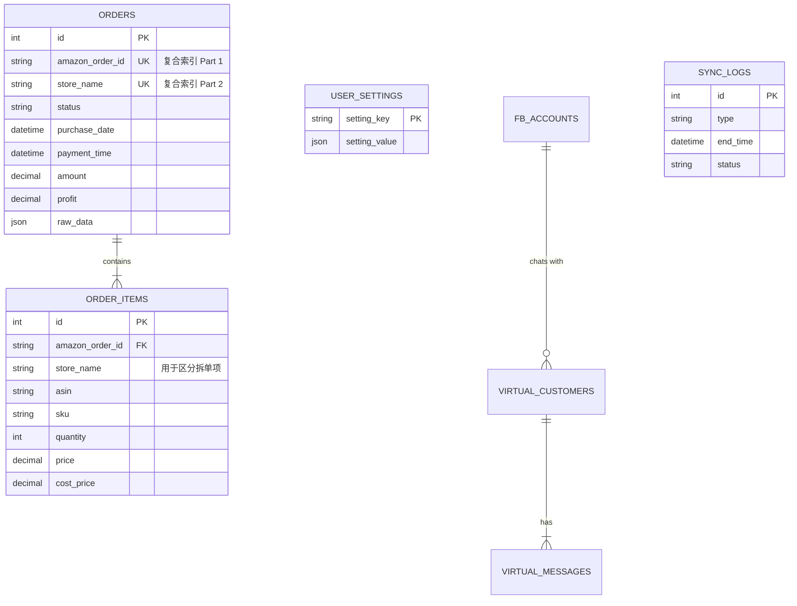

# Tiger ERP 数据库设计文档 (Database Design)

**文档版本**: 1.0  
**最后更新**: 2026-01-19  
**基于代码版本**: H20260119V28  
**数据库类型**: MySQL 8.0  
**字符集**: utf8mb4

---

## 1. 设计概览 (Overview)

Tiger ERP 的数据库设计遵循 **"读写分离，以写促读"** 的原则。
*   **核心业务表 (`orders`)**：存储从亚马逊同步的订单数据，经过清洗和标准化。
*   **原始数据存储 (`raw_data`)**：利用 MySQL 的 JSON 类型存储 API 返回的原始报文，确保在字段映射变更时可回溯，无需重新抓取。
*   **复合主键策略**：为了支持亚马逊的**拆单 (Split Shipments)** 场景（同一个 `amazon_order_id` 可能对应多个不同的店铺或发货单），核心表不再单纯依赖订单号去重，而是采用 `(amazon_order_id, store_name)` 联合唯一索引。

---

## 2. ER 关系图 (Entity-Relationship Diagram)

---

## 3. 表结构详解 (Table Schema)

### 3.1 订单主表 (`orders`)
存储亚马逊订单的核心维度信息。

| 字段名 | 类型 | 属性 | 描述 |
| :--- | :--- | :--- | :--- |
| `id` | INT | PK, Auto Inc | 内部自增主键 |
| `amazon_order_id` | VARCHAR(50) | Not Null | 亚马逊订单号 (3-7-7格式) |
| `store_name` | VARCHAR(100) | | **关键字段**：店铺名称，用于区分拆单 |
| `seller_order_id` | VARCHAR(50) | | 卖家自定义订单号 |
| `marketplace_id` | VARCHAR(50) | | 站点ID (如 ATVPDKIKX0DER) |
| `status` | VARCHAR(50) | | 订单状态 (Pending, Shipped, Canceled) |
| `purchase_date` | DATETIME | Indexed | 订购时间 (UTC) |
| `payment_time` | DATETIME | | 付款时间 (源自 API paymentsDate) |
| `last_update_date` | DATETIME | Indexed | 订单最后更新时间 |
| `ship_by_date` | DATETIME | | 最晚发货时间 |
| `refund_time` | DATETIME | | 退款发生时间 |
| `amount` | DECIMAL(10, 2) | | 订单总金额 (含税含运费) |
| `currency` | VARCHAR(10) | | 币种 (USD, EUR, JPY) |
| `profit` | DECIMAL(10, 2) | | 预估毛利 (销售额 - 成本 - 头程 - 佣金) |
| `buyer_name` | VARCHAR(100) | | 买家姓名 |
| `buyer_email` | VARCHAR(100) | | 买家加密邮箱 |
| `fulfillment_channel`| VARCHAR(20) | | 配送方式 (AFN=FBA, MFN=FBM) |
| `is_business` | BOOLEAN | Default 0 | 是否为 B2B 订单 |
| `is_replacement` | BOOLEAN | Default 0 | 是否为换货订单 (0元单) |
| `local_note` | TEXT | | **本地字段**：运营人员添加的备注 |
| `raw_data` | JSON | | 原始 API 响应报文 (容错备份) |
| `created_at` | TIMESTAMP | Default Now | 入库时间 |
| `updated_at` | TIMESTAMP | On Update | 记录更新时间 |

**索引 (Indexes)**:
*   `PRIMARY KEY (id)`
*   `UNIQUE KEY idx_order_id_store (amazon_order_id, store_name)`: **核心去重逻辑**
*   `INDEX idx_date (purchase_date)`: 用于时间范围查询
*   `INDEX idx_status (status)`: 用于状态筛选
*   `INDEX idx_store (store_name)`: 用于店铺维度聚合

---

### 3.2 订单商品明细表 (`order_items`)
存储订单内的 SKU 级详情。

| 字段名 | 类型 | 属性 | 描述 |
| :--- | :--- | :--- | :--- |
| `id` | INT | PK, Auto Inc | 内部主键 |
| `amazon_order_id` | VARCHAR(50) | FK | 关联主表 |
| `store_name` | VARCHAR(100) | | **范围限定**：归属的店铺 (配合拆单逻辑) |
| `asin` | VARCHAR(20) | Indexed | ASIN |
| `sku` | VARCHAR(100) | Indexed | 卖家 SKU (MSKU) |
| `local_sku` | VARCHAR(100) | | 本地映射 SKU (用于仓库配对) |
| `title` | TEXT | | 商品标题 |
| `quantity` | INT | | 购买数量 |
| `price` | DECIMAL(10, 2) | | 单价 (Item Price) |
| `shipping_price` | DECIMAL(10, 2) | | 运费收入 |
| `tax_price` | DECIMAL(10, 2) | | 税费 |
| `discount_price` | DECIMAL(10, 2) | | 折扣金额 |
| `cost_price` | DECIMAL(10, 2) | | 采购成本 (从商品库同步) |
| `head_cost` | DECIMAL(10, 2) | | 头程运费 (从商品库同步) |
| `image_url` | TEXT | | 商品主图链接 |
| `promotion_ids` | TEXT | | 促销 ID 列表 (逗号分隔) |

**外键约束**:
*   `FOREIGN KEY (amazon_order_id) REFERENCES orders(amazon_order_id) ON DELETE CASCADE`
    *   *注意*：虽然 `orders.amazon_order_id` 不是物理唯一索引（它是复合唯一索引的前缀），InnoDB 允许建立此外键。删除主订单时，会自动级联删除所有 Items。

---

### 3.3 系统配置表 (`user_settings`)
用于存储前端的个性化配置，实现 "Local-First" 体验的持久化。

| 字段名 | 类型 | 属性 | 描述 |
| :--- | :--- | :--- | :--- |
| `setting_key` | VARCHAR(100) | PK | 配置键名 (e.g., `columns_platform_order`) |
| `setting_value` | JSON | | 配置内容 (列宽、显隐、排序) |
| `updated_at` | TIMESTAMP | | 最后修改时间 |

---

### 3.4 社交营销表 (`fb_accounts` & `virtual_customers`)
CRM 模块的基础数据。

**`fb_accounts` (主页授权)**
| 字段名 | 类型 | 描述 |
| :--- | :--- | :--- |
| `page_id` | VARCHAR(50) PK | Facebook Page ID |
| `name` | VARCHAR(100) | 主页名称 |
| `access_token` | TEXT | 长期访问令牌 |
| `is_active` | BOOLEAN | 启用状态 |

**`virtual_customers` (客户档案)**
| 字段名 | 类型 | 描述 |
| :--- | :--- | :--- |
| `id` | VARCHAR(50) PK | PSID (Page Scoped ID) |
| `name` | VARCHAR(100) | 客户昵称 |
| `tags` | JSON | 客户标签 (e.g., ["测评", "退款"]) |
| `last_msg` | TEXT | 最后一条消息摘要 |

**`virtual_messages` (聊天记录)**
| 字段名 | 类型 | 描述 |
| :--- | :--- | :--- |
| `id` | INT PK | 消息ID |
| `customer_id` | VARCHAR(50) | 关联客户 |
| `sender` | ENUM | 'me' (客服) 或 'other' (客户) |
| `type` | VARCHAR(20) | 'text', 'image' |
| `text` | TEXT | 消息内容 |

---

### 3.5 同步日志表 (`sync_logs`)
用于运维监控和排查数据同步问题。

| 字段名 | 类型 | 描述 |
| :--- | :--- | :--- |
| `id` | INT PK | 日志ID |
| `type` | VARCHAR(50) | 任务类型 (ORDER, PRODUCT, ADS) |
| `start_time` | DATETIME | 开始时间 |
| `end_time` | DATETIME | 结束时间 |
| `status` | VARCHAR(20) | SUCCESS / FAILED |
| `details` | TEXT | 详细日志 (抓取条数、错误信息) |

---

## 4. 关键数据流转逻辑

1.  **数据插入 (Upsert)**:
    *   后端使用 `INSERT INTO ... ON DUPLICATE KEY UPDATE` 语句。
    *   如果 `(amazon_order_id, store_name)` 已存在，则更新状态、金额和最后更新时间。
    *   如果不存在，则插入新记录。

2.  **Item 处理**:
    *   在插入/更新 Order 时，会先执行 `DELETE FROM order_items WHERE amazon_order_id = ? AND store_name = ?`。
    *   然后重新插入 API 返回的最新 Item 列表。这确保了如果亚马逊端修改了商品数量或删除了商品，本地库能保持一致。

3.  **JSON 字段的使用**:
    *   `orders.raw_data` 存储完整的 API 响应。这允许我们在不修改数据库结构的情况下，未来提取新的字段（如：亚马逊配送费明细、促销折扣明细等），只需编写 SQL 脚本解析 JSON 即可。
